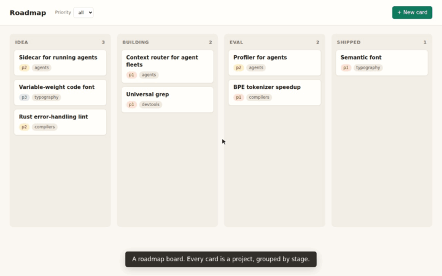

# oxdemo

Scripted product demos that look hand-made. A real cursor glides across your
running app, a ring pops on every click, and captions appear in your product's
own type. The view zooms toward the action and back out. One script gives you
an mp4, a looping GIF, a contact sheet and a caption track.



*That GIF was recorded by oxdemo from [`examples/board.oxd`](examples/board.oxd).*

It is for anyone shipping a web app who needs a launch video or a README GIF,
and who wants to re-record it after every UI change without doing it by hand.

```sh
cargo install --git https://github.com/RohanAdwankar/oxdemo
oxdemo init demo.oxd          # a starter script
oxdemo record demo.oxd        # -> demo.mp4, demo.gif, demo-sheet.png, demo.vtt
oxdemo record demo.oxd --watch
```

It needs Chrome or Chromium; it finds a system install or a Playwright one.
The mp4 needs an ffmpeg with H.264; if there is none on your PATH,
`pip install imageio-ffmpeg` provides one. The GIF, sheet and captions need
nothing else.

## A script

```
url http://localhost:3000
viewport 1440x900
before "./reset.sh && python3 seed.py"
theme font="IBM Plex Sans" caption=#211d19 ring=#0f7a5c

say "A board is just a saved way of arranging sessions by their tags."
click "new board"
clear "board name"
type "board name" "Roadmap"
key Enter
pick "columns" stage
zoom 1.8
drag "Sidecar for running agents" to "building column"
zoom off
say ""
```

Every action waits for the page to settle, meaning no DOM changes, animations,
image loads or requests in flight. Then it pauses for a beat sized to how
much changed. Captions stay up long enough to be read before the next one
replaces them. You write what happens, and the pacing comes out right.

## Why not...

| | real app | cursor and clicks | captions | zoom | scripted, re-recordable | open source |
|---|---|---|---|---|---|---|
| **oxdemo** | yes | yes | in-page, your font | yes | yes | yes |
| Screen Studio | yes | yes | added in the editor | yes | no, recorded by hand | no, paid, macOS only |
| Playwright `recordVideo` | yes | no pointer at all | no | no | yes | yes |
| VHS | terminal only | n/a | no | no | yes | yes |
| Remotion | rebuilt in React | drawn by you | yes | yes | yes | source-available |
| Arcade, Supademo | screenshots | yes | yes | yes | no | no, hosted |

Plain Playwright video is the closest thing, and it looks haunted: things
happen with no pointer on screen. Screen Studio sets the bar for how a demo
should look, but every take is a manual recording. After a UI change you do
the whole take again.

## Targets

A target is whatever a person would call the thing. oxdemo tries these in order:

1. an exact `aria-label`
2. an accessible name: `title`, `placeholder`, `alt`, `aria-labelledby`, `<label for>`
3. exact visible text, lifted to the button or link it belongs to
4. visible text that contains it
5. a CSS selector

6. **text on screen**, when nothing in the page matches: oxdemo reads the
   screen and clicks the words. This is how `click "Graphics"` works on a
   remote desktop, where the whole desktop is one canvas.

`@x,y` is a point on the page, for anything with no text, like a paintbrush
icon or a chess square. `screen:` forces the on-screen text search.

Reading the screen uses [ocrs](https://github.com/robertknight/ocrs), a pure
Rust OCR engine, so there is nothing else to install. Its two models (about
12 MB) are downloaded to `~/.cache/oxdemo` on first use. The time spent
reading is cut from the video. When the same words appear twice, as when a
submenu repeats its parent's label, oxdemo picks the copy that just appeared.
`label:`, `text:` and `css:` force one kind. `>>` narrows the search, so
`"css:nav[aria-label=boards] >> Roadmap"` finds "Roadmap" inside the boards nav.

When a target matches twice, the error lists each match with a selector that
picks out only that one. When it matches nothing, the error lists what is on
screen:

```
demo.oxd:3: failed 0.5s into the take:
  "agents" matches 3 elements (by text)
      span "agents"
          use: "css:section[aria-label='idea column'] >> agents"
      ...
```

## Commands

| command | does |
|---|---|
| `say "text"` | show a caption; `say ""` hides it |
| `click <target>` | glide there, then click where the pointer is |
| `double-click <target>`, `right-click <target>` | the same, with two clicks or the right button |
| `hover <target>` | glide there |
| `type [<target>] "text"` | click the target, then type one key at a time |
| `clear <target>` | select the field's contents and delete them |
| `key Enter`, `key Meta+K` | press a key; shortcuts get an on-screen badge |
| `pick <select> <value>` | set a native `<select>`, by value or option text |
| `drag <target> to <target>` | drag and drop, HTML5 or pointer-based; fails if nothing changed |
| `scroll <target>` | smooth-scroll it into view |
| `upload <target> <file>` | click the target and answer the file chooser |
| `wait-for <target> [10s]` | wait until it exists |
| `goto <url>` | navigate |
| `zoom 1.8`, `zoom off` | ease the view toward the cursor, or back out |
| `draw @x,y @x,y ...` | press, travel through each point, release: a brush stroke |
| `pause 1.5s` | hold |
| `wheel 600 [1.5s]` | scroll with the mouse wheel where the pointer is, smoothly |
| `skip 10s` | wait for real, but cut the wait out of the video |
| `snap still.png` | save a screenshot, without affecting the take |
| `eval "js"` | run JavaScript in the page |

Settings can go anywhere in the file:

| setting | default |
|---|---|
| `url <address>` | required; also a file path or `localhost:3000` |
| `viewport 1440x900` | 1440x900 |
| `scale 2` | 1; use 2 to keep zoomed frames sharp |
| `before "<shell>"` | run before each take, from the script's directory |
| `theme font= size= caption= text= cursor= cursor-stroke= ring= position= offset=` | a dark caption bar at the bottom |
| `video fps= width= crf=` | 30 fps, viewport width, crf 22 |
| `gif fps= width= start= from= to=` | 12 fps, 800 wide, starting on the first caption |
| `output demo.mp4 demo.gif` | all four outputs next to the script |
| `style "css"` | added to every page before recording, e.g. to hide a banner |
| `watch <path>...` | extra paths that trigger a re-record under `--watch` |
| `pace 1.0` | multiplies every automatic pause and cursor move |
| `tail 1.2s` | how long the last frame holds |

## Desktop apps

[`examples/desktop`](examples/desktop) is a Docker image with an XFCE
desktop, GIMP and a text editor, served to the browser by noVNC. oxdemo
records it the same way it records a web app, clicking by position.
[`desktop.oxd`](examples/desktop/desktop.oxd) opens GIMP, renders a plasma
cloud, paints on it, applies filters, and then opens itself in a text editor.
[The result is here](demo/desktop.mp4), and [a 30 second cut](demo/desktop30.mp4) uses `skip` to cut out GIMP's start-up.

```sh
docker build -t oxdemo-desktop examples/desktop
docker run -d --name desk --network host oxdemo-desktop
oxdemo record examples/desktop/desktop.oxd
```

Chrome keeps some shortcuts for itself, such as Ctrl+N, Ctrl+T and Ctrl+W, and
never passes them to the page. Inside a remote desktop, use the menus instead.

## How it works

oxdemo drives Chromium over the DevTools protocol directly. There is no Node
and no Playwright. An overlay injected into every document draws the cursor,
the click ring, the captions and the key badges. Because the page renders
them, they use your fonts and look native. Nothing is burned in afterwards.

Frames come from Chrome's screencast, stamped with the time they were drawn.
They are resampled to a constant frame rate when rendering. Zoom happens at
render time, driven by the cursor's recorded path. The view eases in and out
and follows the pointer with a little lag, the way a camera operator would.
The caption and key badges are pasted back at their normal size and place,
so zooming never crops them out.

The GIF uses one palette for the whole take. Each frame stores only the
rectangle that changed, with unchanged pixels inside it transparent. Stretches
with no change become one long frame. By default the loop starts on the first
caption, because the first frame of a GIF is the one people see most.

The contact sheet shows the whole take on one image. It is the fastest way to
catch a broken beat without watching the video. When a step fails, the sheet
ends on a screenshot of the failure, outlined in red. The failure is also
saved as `<name>-failed.png`.

## Things it handles for you

- **No pointer in headless video.** It draws one, and every move travels along
  an eased arc instead of teleporting.
- **Native `<select>` dropdowns do not render headless.** `pick` travels to the
  control, pauses, and sets it.
- **Drops that land nowhere.** A drop target off screen is an error, and so is
  a drop that changed nothing.
- **Covered or hidden controls.** A click that would land on some other
  element fails and names that element, instead of silently clicking the
  wrong thing.
- **Output paths.** Files go next to the script, and each one is printed with
  its size.
- **Stale state.** `before` runs on every take, and `url` retries while the app
  comes back up.
