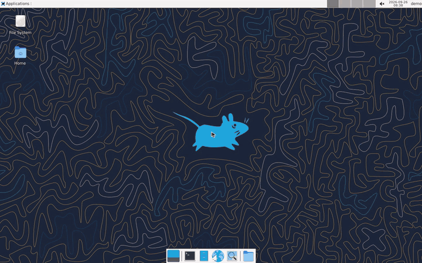

# oxdemo

Scripted demo videos that look hand-made: a real cursor, click rings,
captions, zoom and on-screen keys, recorded from your running app or desktop.



*Recorded by oxdemo from three scripts: [desktop](examples/desktop/desktop30.oxd),
[lichess](examples/lichess/chess.oxd), [vim](examples/vim/vim.oxd).
[Full video](demo/tour.mp4).*

```sh
cargo install --git https://github.com/RohanAdwankar/oxdemo
oxdemo init demo.oxd
oxdemo record demo.oxd    # demo.mp4, demo.gif, demo-sheet.png, demo.vtt
```

Needs Chrome or Chromium. The mp4 needs ffmpeg with H.264
(`pip install imageio-ffmpeg` works).

## A script

```
url https://lichess.org
theme size=42

say "It works on websites too."
hover "TOOLS"
click "Analysis board"
zoom 1.4
drag @773,630 to @773,456
zoom off
key l
```

Each step waits for the page to settle, then pauses for a beat. Captions stay
up long enough to read.

## Why not...

| | real app | cursor | captions | zoom | scripted | open source |
|---|---|---|---|---|---|---|
| **oxdemo** | yes | yes | yes | yes | yes | yes |
| Screen Studio | yes | yes | yes | yes | no | no, paid, macOS |
| Playwright video | yes | no | no | no | yes | yes |
| VHS | terminal only | no | no | no | yes | yes |
| Remotion | rebuilt in React | yes | yes | yes | yes | source-available |

## Targets

A target is what a person would call it: an aria-label, a name, or visible
text. When nothing on the page matches, as on a remote desktop, oxdemo reads
the screen and clicks the words. `@x,y` is a point, for things with no text.
`css:` forces a selector, and `>>` narrows the search.

## Commands

| command | does |
|---|---|
| `say "text"` | caption; `say ""` hides it |
| `click`, `double-click`, `right-click`, `hover <target>` | glide there, then act |
| `type [<target>] "text"` | type one key at a time |
| `key Enter`, `key Meta+K` | press a key |
| `drag <target> to <target>` | drag and drop |
| `draw @x,y @x,y ...` | a stroke through points |
| `pick <select> <value>` | set a `<select>` |
| `clear`, `scroll`, `upload <target> [file]` | clear a field, scroll to it, upload a file |
| `wheel 600 [1.5s]` | smooth scroll |
| `zoom 1.8`, `zoom off` | ease toward the cursor, and back |
| `goto <url>`, `wait-for <target>` | navigate, wait |
| `pause 1s` | hold |
| `skip 10s` | wait, but cut it from the video |
| `snap still.png`, `eval "js"` | screenshot, run JavaScript |

| setting | default |
|---|---|
| `url`, `viewport 1440x900`, `scale 2` | where, and at what size |
| `before "<shell>"` | runs before each take |
| `theme font= size= caption= ring= position= offset=` | caption and cursor look |
| `keys on` | show every key pressed |
| `pace 1.0`, `tail 1.2s` | speed, final hold |
| `style "css"` | CSS for every page |
| `gif`, `video`, `output` | output options |

## Desktop apps

[`examples/desktop`](examples/desktop) is a Docker image with XFCE, GIMP and
vim, shown in the browser through noVNC.

```sh
docker build -t oxdemo-desktop examples/desktop
docker run -d --name desk --network host oxdemo-desktop
oxdemo record examples/desktop/desktop30.oxd
```

Chrome keeps Ctrl+N, Ctrl+T and Ctrl+W for itself, so use menus for those.
